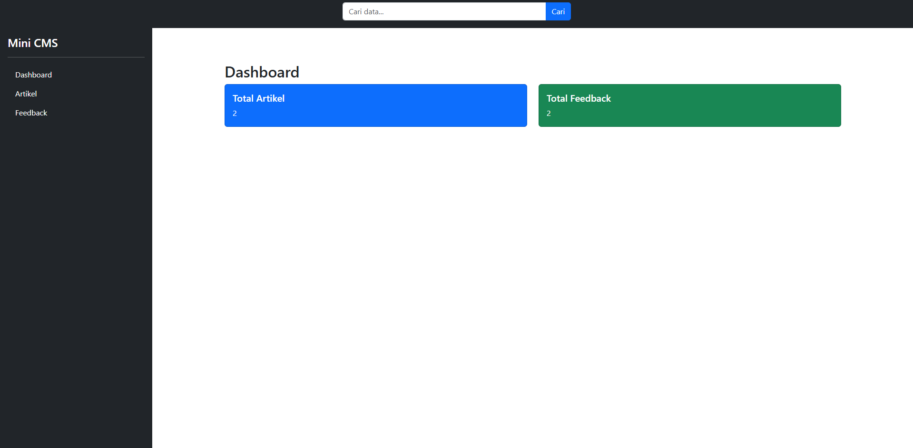
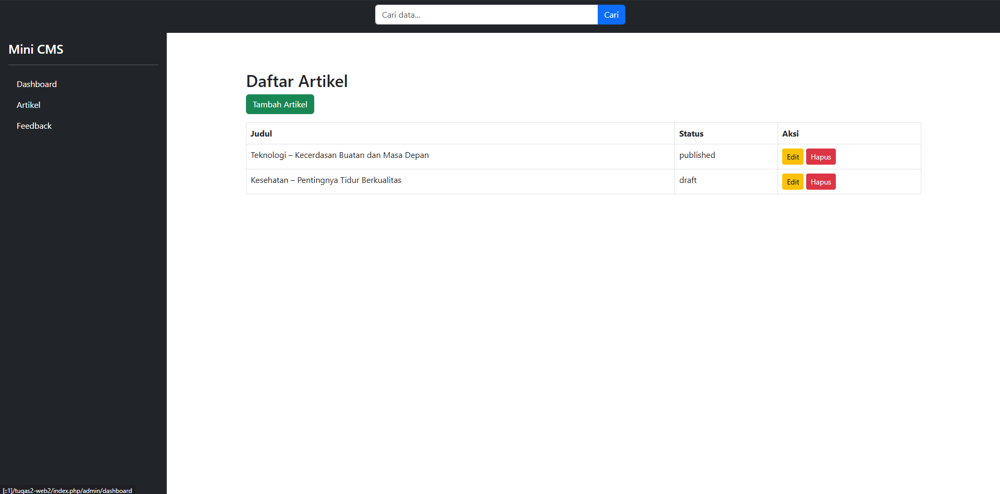
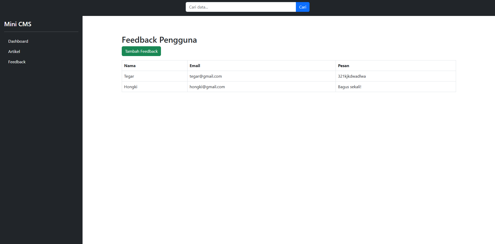

# TUGAS 2 WEB 2


> ### Personal Information
> * Nama: Jodie Soluna Manopo
> * NIM: 230401010196
> * Kelas: IF402
> * Prodi: PJJ Informatika
> * Matkul: Pemrograman WEB 2
> * Type: TUGAS 2

## CRUD PHP Artikel
Aplikasi berbasis web ini dibuat untuk memenuhi TUGAS 2 WEB 2. Aplikasi ini merupakan aplikasi yang mencakup fitur (create, read, update) dari sebuah Artikel.

### I. Struktur Database
---
Queries
```sql
CREATE TABLE artikel (
    id INT AUTO_INCREMENT PRIMARY KEY,
    judul VARCHAR(255),
    status ENUM('draft','published'),
    created_at TIMESTAMP DEFAULT CURRENT_TIMESTAMP
);

CREATE TABLE feedback (
    id INT AUTO_INCREMENT PRIMARY KEY,
    nama VARCHAR(100),
    email VARCHAR(100),
    pesan TEXT,
    created_at TIMESTAMP DEFAULT CURRENT_TIMESTAMP
);
```

### II. Alur Aplikasi
---
1. dashboard.php -> file utama yang akan diakses pertama kali oleh browser yang berisikan tampilan view untuk menampilkan jumlah artikel dan feedback.
2. artikel.php -> file yang berisikan tampilan view untuk table daftar artikel.
3. feedback.php -> file yang berisikan tampilan view untuk table daftar feedback.
4. koneksi.php -> file untuk konfigurasi koneksi database (file ini menerapkan konsep reusable yang nantinya akan digunakan setiap kali kita membutuhkan koneksi database).
5. Daftar Aksi
    1. CREATE
    2. READ
    3. UPDATE
    4. DELETE

### IV. SCREENSHOT
---
1. dashboard.php
    
---
2. artikel.php
    
---
3. feetback.php
    
---
## HOW TO USE
### 1. Restore database
---
```console
   foo@bar:~$ sudo mysql -u db_username -p db_name < database.sql
```
### 2. Setup Database Config
---
```console
    foo@bar:~$ sudo nano ./application/config/database.php
```

> **EXAMPLE**
>
> *filename* : **koneksi.php**
>
>   ```php
>    $username ="root";
>    $password="";
>    $hostname="localhost";
>    $database = "db_jodie"; 
>   ```


### 3. Run Program
---
```console
   foo@bar:~$ php -S 127.0.0.1:8080
```
